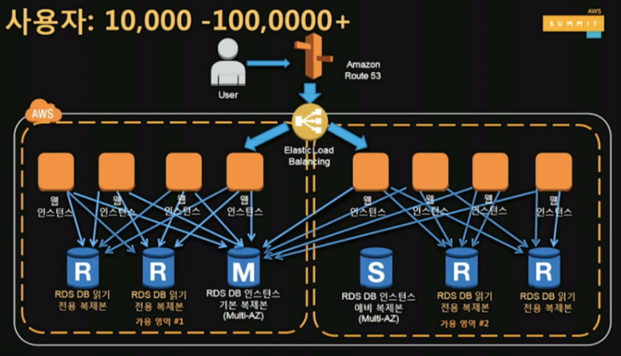
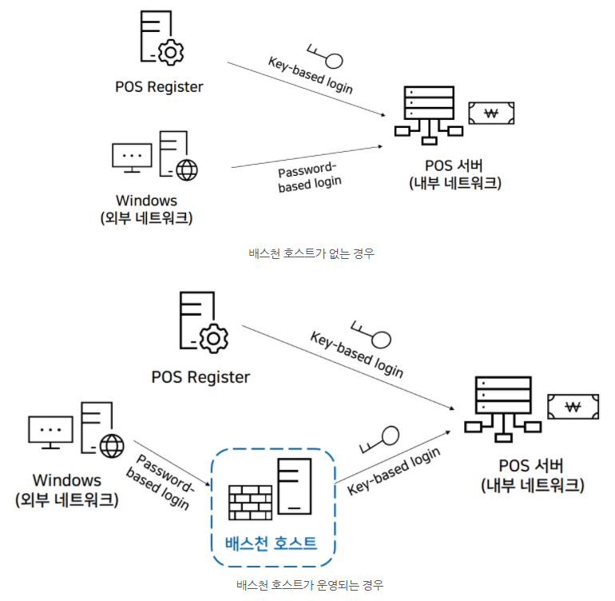
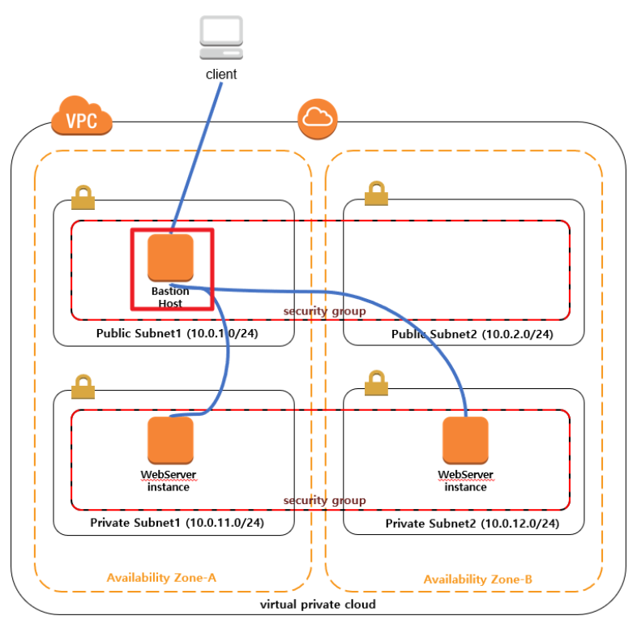
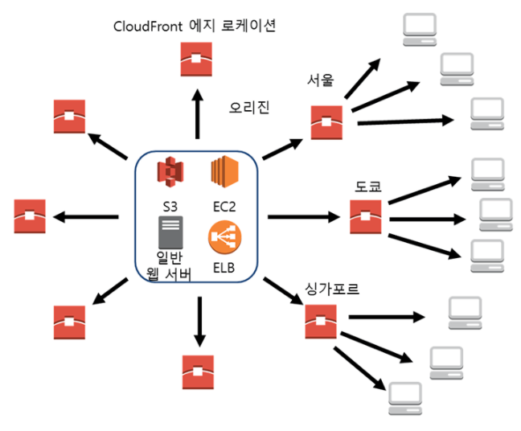
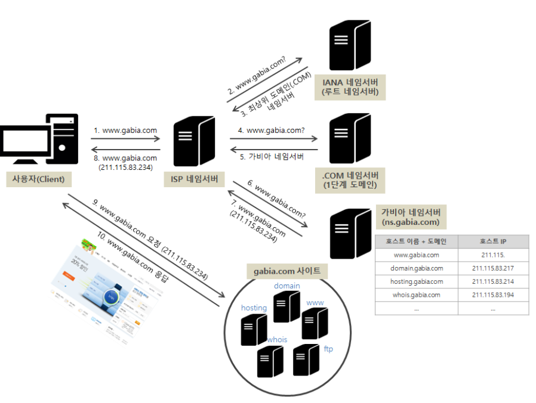

# O주차 20.00.00

## 🔮 헷갈리거나 어려운 문제 목록
- 없음

## 😲 공부하면서 느낀 점 및 후기
- 덤프 문제를 바로 보기엔 기초 지식이 부족하여 AWS 서비스 관련 part 1-3으로 정리가 잘 된 [블로그 글](https://medium.com/@tkdgy0801/aws-solutions-architect-certificate-%EA%B3%B5%EB%B6%80-%EC%98%81%EC%97%AD-1-7abd91cd91a8)을 공부해보았다.  

- vPC 네트워크 개념 완죠니... 어렵다ㅜ ㅜ

## 👻 공부하면서 어렵거나 중요한 개념 정리
### 0. 어제 잘 몰랐던 것!
#### ❓ IOPS (Input/Output Operations Per Second)
HDD, SDD 또는 NVMe등 <b>저장장치의 속도</b>를 나타내는데 사용도는 측정 단위 (MB/s, MiB/s 또는 GB/s, GiB/s)
```
초당 데이터 전송량 = IOPS * 블럭크기(단위 데이터 용량)

IOPS = 초당 데이터 전송량 / 블럭크기(단위 데이터 용량)
```
[IOPS 계산예제](https://hiseon.me/server/iops-calculator/)

<br/>

#### ❓ 기능에 따른 인스턴스 역할
||웹서버 인스턴스|DB 인스턴스|
|------|---|---|
|서비스|AWS EC2, S3 ...|AWS RDS|


<br/>
<p align='middle'>

</p>

- 분산을 위해 ELB 사용 , Multi-AZ를 구성하여 가용성 확보 및 DB 이중화한다.
- 기본 복제본과 읽기 전용 복제본 (Read Replica)를 사용하여 데이터 접근 부하를 줄인다.
- 정적 컨텐츠를 S3와 CloudFront로 이동하여 부하를 분산시킨다.
<br/>

#### ❓ EC2 인스턴스 요금
|기준|온디맨드 인스턴스|스팟 인스턴스|예약인스턴스|
|------|---|---|---|
|요금|실행하는 인스턴스에 따라 시간당 혹은 초당 비용 지불|입찰 가격을 정해두고 저렴할 때 이용가능|계약 기간에 따라 60%까지 저렴하게 이용 가능
|사례|유연하고 저렴하게 인스턴스 사용하거나, 단기간 혹은 첫 개발, 시험중인 경우|시작과 종료시간이 자유롭거나, 컴퓨팅 가격이 매우 쌀 때 수익이 나는 애플리케이션 경우|수요가 꾸준하거나, 예약 용량이 필요할 수 있는 애플리케이션|

<br/>

#### ❓ 배스천 호스트(Bastion Host)

침입 차단 소프트웨어가 설치되어외부 네트워크와 내부 네트워크 사이에서 일종의 게이트 역할을 수행하는 호스트
<br/>
<p align='middle'>

</p>

배스천 호스트가 없는 경우 외부 네트워크에서 공격을 받아 패스워드가 탈취 당한다면 내부 네트워크인 POS Server에 접근이 가능해진다. 반면 배스천 호스트를 운영하고 있다면 외부 네트워크의 패스워드가 탈취 당하더라도 POS Server까지는 접근할 수 없다.

> 배스천 호스트 이외 방화벽 보안 시스템의 구축 유형에 따른 호스트
> - 스크린드 호스트(Screened Host)
> - 듀얼 홈드 호스트(Dual Homed Host)
> - 스크린드 서브넷(Screened Subnet)
> - 멀티 홈드 호스트(Multi Homed Host)

<br/>
<p align='middle'>

</p>

외부에서 접근 불가능한 Private Subnet에 접근하기 위해 Public Subnet에 Bastion Host를 두어 Bastion Host를 통해 Private Subnet에 접근한다.

### 😳 Private Subnet에 있는 인스턴스들도 같은 설정을 해주면 되지않나요?

  한곳에서 모든 접근을 관리하므로써 관리가 수월하며 모든 접근에 대한 로그 또한 한곳에서 확인 가능하다

<br/>

----
<br/>

### 1. 리전과 가용영역
- AWS는 현재 21개 리전과 66개 가용영역 운영
- 리전(Region): 개별 지역 내 존재
- 가용영역(Availabilty zone): 리전 내 가용성 영역
  > `내결함성`이란?
  >
  > 운영중이던 시스템의 <b>데이터가 손실되거나 진행중인 작업이 손상되지 않도록</b>전원 부족 또는 하드웨어 장애와 같은 돌발 사태에 대비할 수 있는 <b>컴퓨터 또는 운영체제의 기능</b>
  >
  > - 미러 볼륨
  >
  >   두 개 이상의 실제 디스크 복제
  > - RAID-5 볼륨
  >
  >     세 개 이상의 실제 디스크(only 동적 디스크)에 걸쳐 패리티를 이용 - 확장X, 미러링X
  > - 클러스터
  >
  >   데이터 저장에서 파일을 저장하는 데 할당할 수 있는 최소 디스크 공간

  > `고가용성` 이란?
  >
  > = 절대 고장나지 않아 작동이 멈추지 않음 
  >
  > 서버와 네트워크, 프로그램 등의 정보 시스템이 상당히 오랜 기간 동안 <b>지속적으로 정상 운영이 가능</b>한 성질
  >
  > (예시)
  >
  > 2개로 묶인 서버 중 1대의 서버에서 장애가 발생하면, 다른 서버가 즉시 그 업무를 대신 수행하므로,
시스템 장애를 불과 몇 초만에 복구할 수 있다.

### 2. EBS와 Instance Store
|기준|EBS|Instance Store|
|------|---|---|
|재부팅(reboot)|보존|보존|
|중단/시작|보존|삭제|
|종료|부트볼륨 삭제|삭제|

### 🥴 Umm,, 그럼 왜 Instance Store를 사용할까?
인스턴스에 <b>직접 연결</b>되어있는 스토리지이기 때문에 EBS 대비 속도가 빠르고 일정수준의 속도가 보장된다. 따라서 소규모 데이터를 캐싱할 때 사용된다.

[실습](https://galid1.tistory.com/371)


### 3. CloudFront
AWS에서 제공하는 CDN 서비스

### 😲 언제 사용될까?
운영하는 서비스가 파일 자체를 업로드하고 다운로드가 할 일이 많을 경우 좀 더 빠른 서비스를 제공하기 위해 사용된다.

<p align='middle'>

</p>

- Origin Server: EC2 인스턴스, S3
- Edge Server/Edge Location

> `CDN`이란?
>
> Content Delivery Network
>
> 분산되어 있는 서버 그룹을 작동 시켜 콘텐츠를 빠르게 전달 할 수 있는 서비스
>
> CDN을 사용하면 <b>HTML 페이지, 자바 스크립트 파일, 스타일 시트, 이미지 및 비디오</b>를 비롯한 콘텐츠 로드에 필요한 자산을 신속하게 전송 가능
> - Origin Server: 원본 데이터를 가지고 있는 서버
> - Edge Server/Edge Location: AWS에서 실질적으로 제공하는 전 세계에 퍼져있는 서버. edge Server에는 요청받은 데이터에 대해서 같은 요청에 대해서 빠르게 응답해주기 위해 <b>Cache 기능</b>을 제공
>
> CDN 제공 콘텐츠 종류
> - Downlad Distribution : HTTP 프로토콜을 이용해서 다운로드할 수 있는 <일반적인 이미지 혹은 정적 파일을 제공받을 수 있다.
>
> - Streaming Distribution : 스트리밍을 위해 사용할 수 있는  HTTP Proressive DownLoad 방식이나 RTSP(Real Time Streaming Protocol)을 지원하는 동영상 콘텐츠를 서비스받을 수 있습니다.


### 4. Route53
Route53은 AWS 리소스(EC2, CloudFront, S3 등) 과 연동 가능한 DNS(Domain Name System) 서비스

<p align='middle'>

</p>


> 🐱‍👤 `호스트`란?
> 서버 프로그램이 돌아가는 머신
>
> 🐱‍💻 `도메인`이란?
>
> IP 주소에 <b>이름</b>을 부여한 것
>
> 도메인은 호스트에 대한 책임과 권한의 영역이다.
>
> - Host name : 실제 서버에 주어진 컴퓨터의 이름이다. (www.naver)
>
> - Domain name : 논리적인 그룹을 표기한다. (.com)
>
> 🐱‍👓 `DNS(Domain Name System`이란?
>
> 도메인과 대응된 IP 주소를 알려주는 서비스
>
> 도메인 구성요소
> - 도메인 네임 서버


### 5. VPC (Virtual Private Cloud)
AWS 계정 전용 가상 네트워크


