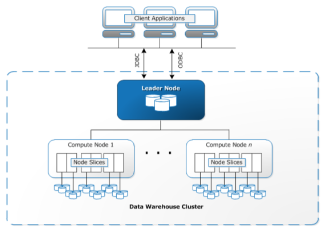

# 1주차 20.21.22

## 🐾 진행상황
  - 27/65 (41%)

## 🔮 헷갈리거나 어려운 문제 목록
- 20
- 22

## 😲 O주차 공부하면서 느낀 점 및 후기
- 생소한 개념들이 있으면 문제 해설을 보더라도 어려운 것 같다.
  - Data Warehouse
  - 스토리지 클래스
    - S3 Intelligent-Tiering 스토리지 클래스
    - S3 Standard-IA 스토리지 클래스
    - S3 One Zone-IA

- 다시 복습하면서 보완해야할 개념
  - CloudFormation Drift Detection
  - Code deploy, Code Build
  - Dynamo DB Deep Dive

## 👻 공부하면서 어렵거나 중요한 개념 정리

### 0. 복습
### ❓ NAT 인스턴스
- 목적

  프라이빗 서브넷의 호스트에 <b>인터넷 트래픽</b>을 제공하는 데 사용
- 위치
  
  always 퍼블릭 서브넷

  💥 프라이빗 서브넷의 호스트에 SSH 연결할 수 없다.

 

### ❓ Bastion 호스트
- 목적

  외부 사용자가 프라이빗 인스턴스에 <b>액세스</b>하는 데 사용
- 어떻게

  외부 사용자가 퍼블릭 서브넷에 Bastion 호스트에 연결을 하고, 프라이빗 서브넷의 인스턴스에 SSH 연결로 액세스!

### ❓ 애플리케이션에 대한 Auto Scaling 이벤트를 검토할 때 탄력성을 유지하면서 비용 최적화 방법
1. Auto Scaling CoolDown 수정
2. Auto Scaling 축소 정책을 trigger하는 CloudWatch 경보기간 수정

 

### ❓ (기본 ACL 설정) 퍼블릭 서브넷 웹서버에서만 프라이빗 서브넷 DB 인스턴스 액세스 가능하도록 하는 솔루션
- 퍼블릭 서브넷 웹서버에 어디서나  HTTPS 포트 443
로 인바운드 트래픽 허용하는 보안그룹 생성
  

- 프라이빗 서브넷 DB 인스턴스에 3306 인바운드 허용하는 보안 그룹 생성 + 웹서버 연결

> 😳 인바운드 트래픽?
>
> 외부 → 서버 내부 
>
> (클라이언트 → 서버)
>
> 😳 아웃바운드 트래픽?
>
> 서버 내부 → 외부 
>
> (서버 → 클라이언트)

 

### ❓ 전 세계 어디에서나 많은 사용자가 빠르게 애플리케이션을 이용할 수 있도록 돕는 AWS 도구
- Cloudfront

  CloudFront는 전 세계 이곳저곳에 Edge Server/Edge Location을 두고 Client에 가장 가까운 Edge Server를 찾아 Latency를 최소화시켜 빠른 데이터를 제공한다. Edge Server에는 요청받은 데이터에 대해서 같은 요청에 대해서 빠르게 응답해주기 위해 Cache 기능을 제공한다.
  
  사용자는 시간 지연이 가장 짧은 Edge Location으로 라우팅된다.

- AWS Global Accelerator

  수신 트래픽은 AWS 리전 내 최적 엔드포인트로 트래픽을 보내준다. 네트워크 계층에서 작동한다.

  AWS Edge network에서 ani-cast되는 고정 IP 제공

 

### ❓ EC2에 배포된 애플리케이션에서 안전한 방식으로 AWS API를 액세스할 수 있는 방법

- EC2 인스턴스에 <b>IAM 역할(Roles)</b> 할당
  
  💥 하지만 프로덕션 애플리케이션에 <b>IAM 자격증명(Credential)</b> 사용하는 건 좋지 않음

 

### ❓ `즉시 다운로드 + 확장성 + 특정 기간 이후 삭제` 를 고려한 AWS 스토리지 솔루션
- AWS S3

> AWS EFS
>
> 💥 파일 삭제 불가!
>
> 특정 기간동안 access 되지 않은 파일을 Infrequent Access Storage Class로 migration
> 
> AWS Glacier
>
> 즉시 다운로드 불가!
>
> AWS EBS
>
> 확장성 떨어짐!

 

### ❓  Elastic BeanStalk

Elastic Beanstalk는 Java, Go, PHP, .NET, Node.js, Python, Ruby 등으로 개발된 앱을 지원하고 각 플랫폼마다 다양한 구성을 지원한다.

 

👼 장점

1. 빠르고 간단한 시작
2. 개발자 생산성
3. 완전한 자원 제어
4. 불필요한 자원 낭비 없음
5. 사용에 따른 추가 요금이 없음.

   사용되는 AWS 리소스(VPC, EC2, LoadBalancer, RDS)에 대한 비용 지불
6. `Docker`에 대응할 수 있음. 
  
    Docker 컨테이너로 deploy 가능!

 

👼 환경 종류

1. Web Server
  
    HTTP/HTTPS 요청을 처리하는 일반적인 웹 애플리케이션을 동작시키는 환경.

2. Worker
  
    시간이 걸리는 처리 등을 백그라운드에서 처리하기 위한 환경.
  
    ex) 동영상 인코딩 처리

 

---
## 1. AWS CloudFormation
AWS 리소스를 자동으로 생성해 주는 서비스

 - AWS 리소스를 모델링하고 설정하는 <b>템플릿 파일</b>을 작성 (yaml or json)
 - 템플릿 업로드
 - CloudFormation은 템플릿 파일을 분석하여 `스택 = AWS 리소스` 생성

 리소스가 더 이상 필요하지 않으면 스택을 삭제하는 것과 같은 방식으로 리소스 관리 시간을 줄일 수 있다! 

 💥 CloudFront랑 이름 비슷한데 헷갈리지 않도록 ㅋㅎ

## 2. Code Deploy
SourceCode를 운영환경에 자동 배포하는 역할을 수행하는 AWS Service

💥 code deploy를 사용하기 위해서는 <b>배포할 EC2가 사용할 Role</b>이 필요하기 때문에 IAM에서 생성!

## 3. AWS KMS API
<b>데이터 암호화</b>에 사용되는 암호화 키를 생성 및 제어할 수 있는 관리형 서비스

- 사용 예시
  
  디스크에 쓰기 전에 데이터 암호화

- 관련 서비스

  - EBS
  - S3
  - Redshift
  - Elastic Transcoder
  - WorkMail

### 4. AWS DataSync
데이터 전송 자동화 도구

### 5. AWS Lake Formation
많은 데이터를 관리할 수 있는 도구

### 6. AWS Redshift
PostgreSQL를 기반으로 하는 Data warehouse를 다양한 비지니스 툴을 사용해서 데이터를 분석하게 해주는 솔루션

> <b>Data warehouse</b> ?
>
> 다양한 운영 환경의 시스템으로부터 축적된 데이터를 추출, 변환, 통합해서 요약한 데이터베이스
>
> <b>ETL(Extract, Tranform, Load)?</b>
>
> 데이터를 추출하고, 변형하여, (Data Warehouse에) 적재하는 과정을 일컫는 말
>
> <b>BI(Business Intelligence)?</b>
>데이터 추출/통합/리포팅을 위한 기본도구 집합, DW에서 분석된 데이터를 통해 숨겨진 패턴을 찾아냄

 👼 ETL을 통해 뽑아낸 데이터를 Data Warehouse에 적재하고, BI를 이용하여 분석하는 기본 과정을 거침

## Redshift의 구성
- 클러스터
  
  Redshift의 핵심 요소! 하나의 리더 노드와 다수의 컴퓨팅 노드를 가지고 있는 구성 요소

- 리더 노드
  
  클라이언트 프로그램과 일어나는 통신을 비롯해 컴퓨팅 노드간의 모든 통신/작업 관리

- 컴퓨팅 노드
  
  실제 작업을 수행하는 노드로, 각 노드마다 전용 CPU와 메모리 내장 디스크 스토리지를 따로 보유함

### 관련 중요 개념
1. 대량 병렬처리(MPP)를 통해 복잡한 쿼리라도 빠른 속도로 실행하여 대용량 처리 가능
2. 열(Column) 단위 데이터 저장방식
3. COPY 명령어를 통해 Amazon EMR, Amazon DynamoDB, S3로부터 데이터를 병렬 로드 가능
4. <b>Enhanced VPC Routing</b>을 통해 클러스터와 VPC 외부의 COPY, UNLOAD 트래픽을 모니터링할 수 있음
    > 👼 Enhanced VPC Routing
    >
    > Redshift에 대한 VPC 리소스 액세스 제공
    >
    > 활성화하지 않으면 Redshift가 NAT 인스턴스에 액세스할 수 없음
5. WLM(Workload Management)를 통해 사용자가 작업 부하 내 우선 순위를 유연하게 관리하도록 지원
6. 보존기간이 1일인 <b>자동 백업을 지원</b>하며, 최대 35일까지 설정 가능
7. <b>단일 AZ 배포만</b>을 지원함

### Redshift vs RDS
- Redshift
  
    보고 및 분석에 사용

    대용량 데이터 세트를 대상을 복합적인 분석 쿼리를 빠르게 실행하는 것에 목표
- RDS

  OLTP(온라인 트랜잭션) 워크로드에 사용
  
  단일 행 트랜잭션에 목표

### 7. DynamoDB
종합 관리형 <b>NoSQL 데이터베이스</b> 서비스로서 원활한 확장성과 함께 빠르고 예측 가능한 성능을 제공

### 장점
- 완전 관리 시스템
    - 스토리지가 꽉 차면 알아서 늘어나고 트래픽이 급증하면 자신의 성능을 일부 조절
    - 백업도 알아서 하기 때문에 개발자는 편함

- 더 빠른 Latency

    어떤 규모의 서비스에서도 빠른 응답이 가능

- 원자성 트랜잭션 지원

    NoSQL의 고질적인 단점이였던 원자성 트랜잭션을 지원

- 나름 저렴한 유지비

  사용한 만큼만 지불하는 온디멘드와 사용할 만큼 미리 결제하는 프로비저닝이 있음

- 전용 캐시 솔루션

  DAX를 사용했을 때는 1ms 미만의 레이턴시의 응답속도

  추가적인 비용을 내고 인 메모리 캐시 솔루션인 DAX(DynamoDB Accelerator)를 사용

[DynamoDB Deep Dive](https://aerocode.net/298)

### 8. CloudFront에서 캐시된 데이터로 올바른 언어
- 쿼리 문자열 매개 변수 기반

### 9. S3 Intelligent-Tiering 스토리지 클래스
웹 어플리케이션이 S3 버킷에 액세스하는 패턴을 예측할 수 없을 때 사용

두 가지 액세스 패턴
- 빈번한 액세스
- 빈번하지 않은 액세스

스토리지 클래스와 성능 동일