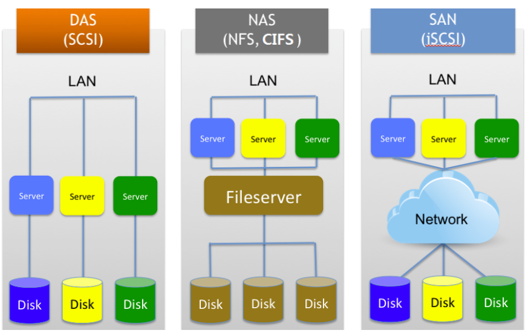

# 1주차 20.12.22

## 🐾 진행상황
- CSAA 연습시험 1
      - 59/65 (91%)

## 🔮 헷갈리거나 어려운 문제 목록
- 37, 38 (Redshift)
- 39

    문제가 너무 기네;ㅎ
- 40
    
    고성능 아키텍처 설계 부분이 생소생소
- 57
    
    RDS을 고가용성으로 운영하는 방법
- 59
    
    EC2 배치 전략 (Cassandra에 일단 띠용;) 

## 😲 공부하면서 느낀 점 및 후기
- VPC 관련 개념이 굉장히 많다는 것을 오늘 또 한번 느낀다.
    - VPC 엔드포인트(AWS PrivateLink)
    - AWS Site-to-Site VPN

- ASG.. 공부해도 모르는 게 또 나온다. 쏘 퍼니하다ㅋㅋ
    - 조정 정책

        대상추적조정정책, 단계조정정책, 단순확장정책, 예약된 조정 정책

- 오늘도 AWS에서 제공하는 새로운 서비스를 알게 되었다 허허허
    - AWS Storage Gateway
    - CloudTrail

- 호스팅 개념을 정리할 필요성을 느꼈다.

- RDS 배포 관련 되서 정리해야겠다
    - 워크로드
    - 다중 AZ배포

## 👻 공부하면서 어렵거나 중요한 개념 정리

### 0. 복습

### ❓ RedShift 클러스터의 교차 리전 스냅샷
- 교차 리전 스냅샷을 통해서 다른 리전에서 사용할 수 있다. 즉, 멀리 떨어진 지역에서 사용할 수 있는 것이다. 

### ❓ RedShift 암호화
Redshift는 암호화 키 계층을 사용하여 데이터베이스를 암호화함

<b>AWS KMS 또는 HSM(하드웨어 보안 모듈)</b>을 이용하여 이 계층의 최상위 암호화 키 관리

### ❓ 그래서 NAT가 뭐하는거죠

NAT(Network Address Translation)

사설 IP를 공인 IP로 변경에 필요한 주소 변환 서비스

라우터 등 네트워크 장비로 다수의 사설IP를 하나의 공인IP주소로 변환하는 것이다.

#### 🐱‍👓 왜 필요하지?
1. 공인 IP 주소 절약
2. 보안 목적

#### 🐱‍💻NAT 테이블

#### 🐱‍👤 NAT 시나리오
1) 내부 네트워크에 위치한 호스트들의 사설 IP와 포트 번호에 대한 정보를 가지고 있음.

2) 외부로 나갈 때의 동일한 공인 IP와 각기 다른 포트 번호를 가지고 있음.

3) 목적지 주소의 공인 IP와 서비스에 사용된 동일한 서비스 포트 번호를 가지고 있음.

1) 사설 IP - 192.168.1.1을 사용하는 호스트가 68.1.31.1에 접속을 원한다.

2) 라우터는 NAT 기술을 사용하여 이 요청에 공인 IP - 101.89.101.12와 포트 번호 8801을 할당한다.

3) 요청은 인터넷을 통해 텔넷 서버 - 68.1.31.1.1에 도달한다.

4) 텔넷 서버는 요청의 클라이언트 IP를 공인 IP - 101.89.101.12, 포트 8801로 인식하고 응답한다.

5) 텔넷 서버의 응답이 라우터에 도착한다. 라우터는 포트 번호 8801을 응답 패킷에서 인식한다.

6)  라우터는 사설 IP 192.68.1.1:9688 호스트에 할당된 포트임을 NAT 테이블에서 찾아 응답을 돌려준다.

### ❓ [NAT 게이트웨이 vs NAT 인스턴스](https://docs.aws.amazon.com/ko_kr/vpc/latest/userguide/vpc-nat-comparison.html)

- NAT 게이트웨이

    NAT 게이트웨이는 VPC의 퍼블릭 서브넷에서 자동으로
생성.

-  NAT 인스턴스

    인터넷으로 트래픽을 전송할 수 있으며 따라서 프라이빗 서
브넷의 인스턴스는 소프트웨어 업데이트를 받을 수 있다.

    NAT 인스턴스가 프라이빗 서브넷의 인스턴스에서 인터
넷 바운드 트래픽을 수신하고 네트워크에서 SSH 트래픽을 수신할 수 있도록 NAT 인스턴스(NATSG)에 대한 보안 그룹이 필요하다.

 

### ❓ DynamoDB의 쓰임새 

일반적으로 Simple Storage 서비스와 함께 사용된다.

- 메타데이터를 영구적으로 저장 
- 보조 인덱스 생성

### ❓ EBS 스냅샷

EBS 볼륨을 백업하는 데 사용된다.

다른 지역에서 EBS 스냅샷을 사용하기 위해서, 타겟 EBS에서 스냅샷을 생성하고 스냅샷을 새로운 리전에 복사해야 한다.

### ❓ Route53 까먹었

Route53은 도메인과 과련된 서비스 제공!

레코드 세트

S3에서 정적 웹사이트를 호스팅하고 Route53을 도메인 등록기관으로 사용하여 배포한 앱에 대한 도메인을  통해 달아준다.

 

----

### 1. Amazon Aurora
- 64TB의 스토리지 제한
- 8TB 초기 저장 용량
- 하루 8GB의 데이터베이스 증가를 수용할 수 있는 능력
- 하나의 AWS 리전에 걸쳐있는 가용영역에 분산될 수 있는 Aurora 복제본을 최대 15개까지 가질 수 있음
- Aurora 복제본은 클러스터 볼륨에 대한 읽기 작업 전용

 

### 2. AWS Storage Gateway
온 프레미스 애플리케이션이 AWS 클라우드 스토리지를 원활하게 사용할 수 있도록 지원하는 하이브리드 스토리지 서비스

- S3를 iSCSI 방식으로 제어
- 온프레미스 환경과 S3를 손쉽게 결합하여 사용할 수 있게 해준다
- 백업 스토리지 용량 확장성

### 😲 iSCSI 검색하다 스토리지 구성 공부

스토리지 구성은 서버와 저장장치를 연결하는 방법에 따라 다르다.

|기준|DAS|NAS|SAN|
|------|---|---|---|
|연결방식|서버와 저장 장치를 직접 연결|서버와 저장장치가 이더넷 등의 LAN 네트워크로 연결|서버와 저장장치를 Fiber Channel Switch를 이용해 고속 연결(데이터 전용망)
|특징|포트수 제한|- DAS와 달리 Port 수 제한 없어 확장성과 유연성이 뛰어남 - DAS보다 파일전송속도 느림 - 파일시스템 공유|확장성, 유연성, 가용성이 우수|

#### IP-SAN
기존 SAN 네트워크를 Gigabit Ethernet과 같은 IP 네트워크를 이용하여 확장한 IP기반의 스토리지 네트워크

호스트와 SAN 노드 사이에서 TCP/IP 프로토콜을 사용하여 SCSI 명령과 데이터를 전송

💥 SCSI와 IP간 프로토콜 변환이 필요

1. Gateway-Cached Volume

- S3에 기본데이터를 저장하며 빠르게 엑세스할 필요가 있는 데이터는 <b>로컬 스토리지에 캐싱</b>하여 사용할 때의 구성방식

2. Gateway-Stored Volume

- ❗모든 데이터❕를 빠르게 액세스할 필요가 있는 경우 
    -  로컬에 모든 데이터 저장
    -  특정 시점에 데이터를 비동기적으로 S3에 저장
    
         백업만 S3로만 하고 싶을 때 용이하다.

💥 온프레미스 또는 EC2 인스턴스에서 iSCSI 디바이스로 마운트할 수 있는 iSCSI 대상을 제공한다.

3. Gateway-VTL Volume
이 방식은 보통 tape 방식의 백업을 사용하는 솔류션에서 사용하는 VTL (Virtual Tape Library) 형태의 interface를 제공하여 S3에 백업하고 이를 장시간 유지하도록 Glacier로 다시 아카이빙 할 수 있도록 하는 방식이다. 

 

### 3. AWS ElasticCache
클라우드에서 분산된 인메모리 데이터스토어 또는 캐시를 손쉽게 배포, 운영 및 확장할 수 있게 해주는 웹서비스

<b>느린 디스크 기반의 데이터베이스</b>가 아닌 메모리 캐시에서 정보를 검색하고 분석하기 때문에 처리량을 개선할 수 있고 그 덕분에 더욱 고성능의 서비스를 제공

정리하자면, 데이터베이스에 대한 공통 쿼리를 캐시하기 위해 데이터베이스 앞에서 사용할 수 있는 인메모리 솔루션
→ 데이터베이스 성능 병목 현상 해소 ❣

- 두 가지 오픈소스인 메모리 엔진 지원
    > Redis
    >    
    > 메모리 데이터 스토어 및 캐시
    >
    > ElastiCache는 Memcached와 프로토콜이 호환되므로 기존 Memcached 환경에서 사용하는 주요 도구가 ElastiCache에서 원활하게 작동
    >
    > Memcached
    >
    > 메모리 객체 캐싱 시스템
    >
    > ElastiCache는 Memcached와 프로토콜이 호환되므로 기존 Memcached 환경에서 사용하는 주요 도구
    >
    > 💥 Memcached는 Redis에서 제공하는 스냅샷 생성과 Read Replica기능을 사용할 수 없으며 당연히 Read Replica 마스터 캐시 노드의 Failover 기능(Read Replica 승격)도 사용할 수 없다.

- 장점
    - 확장 가능
        
        Memcached용 Amazon ElastiCache에는 샤딩이 포함되어 있으므로 인 메모리 캐시를 <b>최대 20개의 노드까지</b> 확장할 수 있다. 
        
        Redis용 Amazon ElastiCache에는 클러스터링이 포함되어 있으므로 <b>최대 15개의 샤드</b>로 3.55TiB 규모의 단일 인 메모리 키 값 스토어를 구성하고 더불어 <b>샤드당 최대 5개의 읽기 전용 복제본</b>을 구성하여 데이터 액세스 성능을 향상할 수 있다.
    - 다중 AZ 지원
    - 통합

        Amazon ElastiCache는 Amazon RDS, Amazon DynamoDB, Amazon EC2, Amazon CloudWatch 및 Amazon SNS

### 4. SQS 가시성 제한 시간
SQS의 기본 표시 제한 시간은 30초

만약 애플리케이션이 처리완료하는 데 30초 이상이 걸린다면, <b>가시성 제한시간</b>을 늘려야 한다. 이렇게 하면 메시지가 숨겨지기 때문에 소비자가 처리중인 동일한 파일을 처리하지 않는다.

 

### 5. Amazon FSx
완전관리형 MS Windows 파일시스템을 제공

- MS Application 기능과 호환성 제공
- 데이터 중복제거 기능으로 50% ~ 60% 비용 절감
- Lusture 파일 시스템 지원

> 🤔 Lusture 파일 시스템
>
> HPC 애플리케이션에 사용할 수 있는 오픈 소스 병렬 파일 시스템
> 
> EBS에서 구성 가능하지만 FSx 대비 추가 구성이 많이 필요하다.

 

### 6. Amazon EFS
Amazon EC2 인스턴스에 사용할 수 있는 간단하고 확장 가능한 파일 스토리지를 제공

- 스토리지 용량이 탄력적
- 저장 사용량 만큼만 비용이 발생
- 💥MS Windows 파일시스템을 제공하지 않음

 

### 7. VPC 흐름 로그
VPC의 네트워크 인터페이스에서 송수신되는 IP트래픽에 대한 정보를 캡처할 수 있는 기능

CloudWatch Logs를 사용하여 데이터 저장

 

### 8. AWS Trusted Advisor
비용 절감, 시스템 성능 및 안정성 개선, 보안 격차 해소를 목표로 AWS 환경을 검사

AWS 사용 모범 사례를 관찰하는데 도움됨

 

### 9. CloudTrail
AWS 계정의 거버넌스, 규정 준수, 운영 감사 및 위험 감사를 지원하는 서비스

AWS 인프라 전체에서 작업과 관련된 계정 활동을 기록하고, 지속적으로 모니터링하고 유지

💥 1개의 CloudTrail이 AWS 계정의 모든 리전에서 추적할 수 있다.

🦊 언제 사용되요?

    모든 리소스에 대한 API 호출을 모니터링.
    해당 로그파일은 S3 버킷 또는 선택적으로 CloudWatch Logs 그룹에 전송됨.

🐰 CloudTrail 대비 CloudWatch의 차이점은요?
    
    ELB에 즉시 읽기 요청 수와 지연수에 대한 지표 데이터가 저장

 

### 10. AWS SNS
구독 중인 엔드포인트 또는 클라이언트에 메시지 전달을 조정 및 관리하는 웹 서비스

- 게시자(Publisher)

    이벤트 생산

- 구독자(Subscriber)

    이벤트 구독

    특정 Topic에 대한 알림이 오면 특정 서비스를 하거나 알림에 대한 정보를 알 수 있다.

- 주제(Topic)

    - Publisher가 게시하는 대상
    - Subscriber가 구독하는 대상

 

### 11. AWS S3 비용 최적화

사례

    EC2 인스턴스가 프라이빗 서브넷에 있다. 
    S3 버킷이 EC2 인스턴스와 동일한 리전에 배치되어있다.
    EC2 인스턴스는 더 큰 파일을 S3 버킷에 자주 업로드하고 다운로드해야 한다.
    이 때, 데이터가 인터넷을 통해 노출되는 것을 원치 않는다.

(해결방식)

- <b>S3용 VPC 엔드포인트 생성</b>
- <b>모든 트래픽 Amazon 사설 네트워크 통과</b>
- <b>라우팅 테이블</b>을 사용
    
    엔드포인트를 통해 AWS S3의 리소스에 액세스 할 수 있는 인스턴스 제어

(비용이 많이 드는 방식)

S3서비스를 액세스할 수 있는 IAM 역할을 생성하여 EC2에 할당

    Why?

    빠르지만, 퍼블릿 서브넷의 EC2인스턴스가 엔드포인트를 통해 S3에 액세스하기 때문에 매 요청마다 비용이 든다. 
    또한 엔드포인트를 사용하면 인터넷을 사용해야 한다.
    다운로드 트래픽이 인터넷으로 노출되기 때문에 요구사항에 맞지 않다.

 

### 12. AWS SDK (Software Development Kit)
AWS에서 애플리케이션 개발 및 관리를 위한 도구

 AWS를 프로그래밍적으로 제어하기 편리하도록 제공되는 언어별로 라이브러리들을 제공한다.

 

### 13. HTTP GET 요청의 Range 헤더

객체의 지정된 범위 바이트로 개체의 지정된 부분을 다운로드 할 수 있다.

 

### 14. VPC 피어링
두 VPC 간에 트래픽을 <b>비공개로 라우팅</b>할 수 있는 두 VPC 간 네트워킹 연결이다. 두 VPC에 있는 인스턴스들은 마치 하나의 동일한 네트워크에 있는 것처럼 서로 통실할 수 있다.

🤩 언제 사용할 수 있어요??
    
    동일한 리전의 다른 VPC에 있는 다른 AWS 계정의 데이터에 액세스해야할 경우

 

### 15. 캐시를 사용하여 S3 버킷을 여러 AWS 리전에 교차 리전 복제 활성화하면 성능이 향상될까?

아니다. 여러 지역에 여러 S3 버킷을 생성하기 때문에 캐시를 사용하면 성능이 향상되지 않는다.

 

### 16. ELB가 아니라 NAT 인스턴스에 병목현상이 생기는 이유가 무엇?

> NAT(네트워크 주소 변환) 서버는 개인 서브넷에서 Amazon EC2 인스턴스에 아웃바운드 인터넷 연결을 제공하는 데 사용

인바운드 트래픽은 로드 밸런서를 통해 들어오고 이 트래픽에 대한 응답도 로드 밸런서를 통해 종료된다. Elastic Load Balancing 서비스는 트래픽 양에 따라 자동으로 확장된다. 

개인 서브넷의 EC2 인스턴스가 인터넷 연결을 시작하려는 경우(예: 업데이트를 다운로드하거나 Amazon S3와 통신하려는 경우) <b>로드 밸런서의 트래픽을 "밖"으로 전송할 수 없다.</b> 대신 <b>서브넷은 아웃바운드 트래픽을 NAT 서버로 라우팅</b>하도록 구성되며, NAT 서버는 인터넷에서 데이터를 요청하는 프록시 역할을 한다.

NAT 서버가 병목 현상이 될 수 있다. 더 큰 인스턴스 유형을 사용하도록 인스턴스를 수정한다. 이렇게 하면 CPU와 RAM이 추가될 뿐만 아니라 네트워크 대역폭도 추가된다.

 

### 17. AWS Lambda

함수가 실행되는 시간에 대해서만 비용을 지불하기 때문에 자체 인스턴스를 프로비저닝하는 것보다 비용이 저렴하다.

🐹 언제 쓰는 것이 좋나요?
여러 API를 소유하고 있을 때, 이를 API용 코드로 변환하여 Lambda 함수로 배포할 수 있다.

### 18. ASG의 조정 정책들^^

- 대상 추적 조정 정책

    대상 인스턴스 수에 비례하여 증가/감소하는 사용률 지표를 기반으로 조정
    ex) ASG 총 CPU 사용률 60% 유지

- 단계 조정 정책

    하나의 목표가 아닌 여러 단계적으로 용량 조정

- 단순 확장

    단일 조정에 따라 용량 변경

- 예약 조정

    목표가 아닌 일정에 따라 용량이 조정

    (사례 1)
    
    매주 지정된 시간에 인스턴스 시작/종료되도록 CloudWatch 이벤트 규칙 구성

    대상: Lambda 함수

    (사례 2)
    
    확장할 일정을 정의

    대상: 트래픽 예측 가능한 App

 

### 19. [재해 복구 시나리오](https://aws.amazon.com/ko/premiumsupport/knowledge-center/fail-over-s3-r53/)

💛 적절한 시나리오

Route53을 사용하여 다른 리전의 다른 인스턴스로 요청 라우팅

🖤 부적절한 시나리오

1. ELB를 사용하여 트래픽을 다른 리전 또는 가용영역으로 호스팅

2. CloudFormation을 이용하여 다른 AZ에 백업 리소스 생성

Why?
    
    - ELB는 하나의 리전에서만 트래픽을 밸런싱할 수 있다.
    - 일반적으로 재해가 발생하면 전체 리전에 영향을 받는다고 가정한다. 따라서 AZ에 백업하는 것은 재해복구목적에 적절하지 않다.
    
