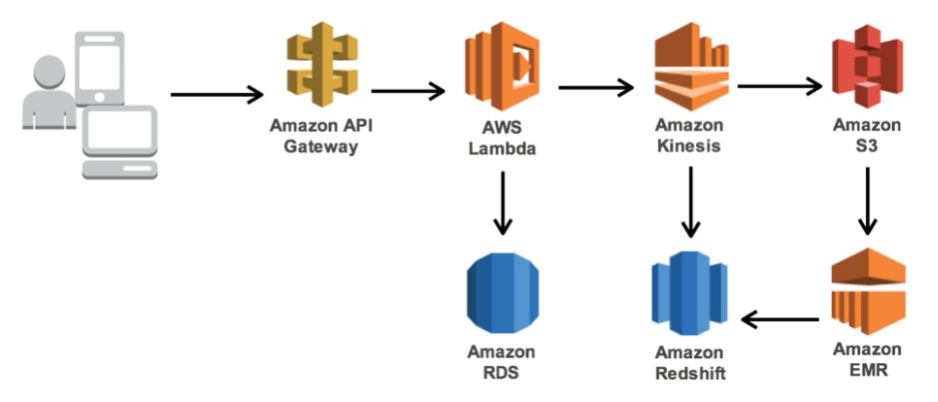
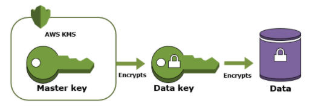
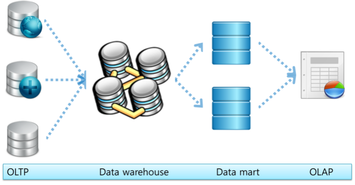

# 1주차 20.12.24

## 🐾 진행상황
- CSAA 연습시험 2 (35/65) 맞음 주룩
- 공부 18번까지 함

## 🔮 헷갈리거나 어려운 문제 목록

- 1, 2, 
- 3- emr?
- 10-CDN 서명된URLvs서명된쿠키
- 11,12-omg; 다이나모디비 스트림/ RDS 백업-스토리지볼륨vs전체(2?4?)
- 16, 59 ,62
  - cognito 자격증명풀 vs  연동자격증명공급자/ Cognito ID/ Microsoft Active Directory
  - cognito identity/ saml/ oidc
- 25,27,30,32 ;;;;
- 31 온디맨드로 확장되지 않는다는게 뭔소리야
- 39, 41;
- 42, 44,45 SCP??? aWS Organization AWs ram? ec2 전용호스트?
- 48 AWS dms;;; 엔진변환도구
- 53 -S3 OAI;; 버킷정책과 객체ACL
- 57 - woll;w;;;;;;dd aws direct connect/ VGW/ VPN 
- 65 - PCI  규정 준수 범위?

헷갈ㅋㅎ
- 7-vpc피어링/vpc엔드포인트
- 9- IAM와KMS 차이/IAM역할, 액세스키와 액세스그룹차이
- 14 - 와우;;;ㅋㅋㅋㅋㅋㅋ;;; emr?;; kinesis streams/firehose
- 15, 49
  - aws datasync와 storage gateway/aws transfer/aws transefer acceleration/
  - aws snowball/aws direct connect
- 17-c?d?
- 18 - elb가 다른가용영역에 걸쳐서 사용될수 있남?
- 19- 오로라가 rds엿남? ;
- 26- 메타데이터 저장소~
- 33,36
- 43
- 46 - 내결함성 기억안남;
- 57
- 63 nnnbbㅠㅠㅠ

## 😲 공부하면서 느낀 점 및 후기
- VPC;;;;;; ㅠㅠㅠㅠ어떡해
- 시간재고 쭈욱 풀어봣다ㅎㅎ 반타작했당 신년부터 AWS에 찐하게 치였다 cheers

## 👻 공부하면서 어렵거나 중요한 개념 정리

## 0. 복습
### 👑 다른 리전에 있는 인스턴스가 DB 인스턴스에 접근하려면 어떻게 해야할까?

<b>DB에 VPC 엔드포인트 추가</b>한다!! 따라서 사용자는 VPC 엔드포인트를 통해 DB 관련 Amazon 서비스에 비공개로 통신할 수 있다.

리전 간 VPC 피어링 연결하는 건 방법이 아니다ㅋ

### 👑 CloudFront Origin
1. 오리진 구성하는 방식
- 원본액세스ID OAI:Origin Access ID

> 어디에?
>
> 새로운 S3버킷을 새 CloudFront 배포 오리진으로 구성할 때, S3 URL가 아닌 CloudFront를 통해서만 S3파일에 액세스하도록 해야할 때 사용

2. 파일에 대한 액세스 제어 방식
- 서명된 URL
- 서명된 쿠키
|기준|서명된 URL|서명된 쿠키|
|------|---|---|
|액세스제어방식|하나의 파일에 대해서만 액세스 제어|사용자별로 액세스 제어 가능 (액세스 권한 정보에 대한 쿠키 전달)|

### 👑 DynamoDB 스트림

DynamoDB의 테이블에 있는 항목의 변경사항에 대한 순서 흐름

즉, Dynamo 스트림을 활성화하면 모든 테이블의 데이터에 대한 수정 사항 정보가 캡처된다.

🖐 Dynamo 스트림 활성화하면 스트림 ARN을 작성한 Lambda 함수와 연결할 수 있다. 어떻게???

 테이블의 데이터가 수정된 후에 해당 테이블 스트림에 새 레코드가 나타난다. AWS Lambda는 스트림을 폴링하고 새 스트림 레코드를 감지한 후에 Lambda 함수를 동기적으로 호출한다.
>
> 사례: 모바일 게임
> 
> '게임점수' 테이블에서 최고 점수 데이터가 업데이트된다. 이 때, 스트림 레코드가 해당 테이블 스트림에 기록된다. 본 이벤트를 통해 소셜미디어에 축하메시지를 게시하는 Lambda 함수를 트리거 할 수 있다. 

### 👑 NAT 게이트웨이를 고가용성으로 만들기

여러 가용 영역에 리소스가 있고 하나의 NAT 게이트웨이를 공유하는 경우 안돼!!!!

가용영역 독립적인 아키텍처로!

각 가용영역에 NAT게이트웨이를 생성하고 리소스가 동일한 가용영역에서 NAT 게이트웨이를 사용하도록 라우팅 구성하기!

 

## 1. 네트워크 장치

### EFA(Elastic Fabric Adapter)

네트워크 장치, 추가 기능이 있는 ENA(Elastic Network Adapter)

ENA(Elastic Network Adapter)와 ENI(Elastic Network Interface)보다 더 나은 네트워크 성능을 얻을 수 있다.

즉, 인스턴스 간 통신의 성능을 향상시킬 수 있다.

### EFA가 가장 적합한 앱?
    고성능 컴퓨팅(HPC) 및 <b>기계학습 애플리케이션</b>을 가속화하는데 사용된다.

## ENI(Elastic Network Interface)
  💥 필요에 따라 성능을 향상시킬 수 없다.

## ENA(Elastic Network Adapter)

💥 필요에 따라 성능을 향상시킬 수 없다.

## 2. 마이그레이션
### AWS 서버 마이그레이션 서비스
온프레미스 워크로드를 AWS EC2로 마이그레이션

### AWS DataSync
주로 NFS 서버스를 S3, EFS, Fsx 등으로 마이그레이션

💥 데이터베이스 마이그레이션 지원 안함

### AWS 데이터베이스 마이그레이션 서비스 
온 프레미스 데이터베이스를 AWS로 마이그레이션

### AWS Migration Hub
AWS에서 마이그레이션 진행상황 추적

## 3. 데이터저장소 (또다시)

### Amazon Kinesis
수천 개의 소스에서 <b>실시간 스트리밍 데이터</b>를 수집하고 처리 및 분석

리전의 여러 가용 영역에 기본 24시간 저장되며 최대 7일 까지의 안전한 데이터 보관

> 실시간 스트리밍 데이터?
> 기계학습, 비디오, 오디오, 애플리케이션 로그, 웹사이트 클릭스트림 및 IoT 원격 측정데이터

- Amazon Kinesis Streams

  실시간으로 데이터 읽기

- Amazon Kinesis Firehose

  다른 AWS서비스로 데이터 전송

### AWS EMR(Elastic Map Reduce)
관리형 하둡 서비스

데이터 집약적인 워크로드가 있는 애플리케이션을 처리하는 데 사용

Apache Spark, HBase, Presto, Hive와 같이 널리 사용되는 분산 프레임워크를 실행

 

#### 😁 EMR을 활용하여 실시간으로 수집되는 Kinesis 스트림을 쿼리하는 작업을 할 수 있다.

 

## 4. KMS(Key Management Service)
KMS는 이 CMK를 쉽게 생성하고 제어하는 관리형 서비스다.

> CMK(Customer Master Key)?
>
> 고객 마스터 키
>
> 데이터 키를 암호화/복호화하는 데 사용하는 암호화 키다.

Region 별로 다른 KMS 사용한다.

​모든 어카운트가 공용으로 사용(multi-tenanted HSM), 생성한 키는 외부 export 불가능하다.

### KMS 암호 키를 사용한 데이터 암호화가 가능한 AWS 서비스

- EBS, S3, RDS
- Redshift
- Elastic Transcoder, Amazon WorkMail

## 5. Amazon RDS 자동 백업 프로세스
- <b>5분</b>마다 <b>트랜잭션 로그 캡처</b>하여 S3버킷에 저장
- <b>하루(24시간)</b>마다 <b>데이터베이스 인스턴스의 스토리지 볼륨 스냅샵 생성</b>

## 6. OLAP, OLTP

|기준|OLAP(Online Transaction Processing)|OLAP(OnLine Analytical Processing)|
|------|---|---|
|주요역할|온라인 분석 처리|온라인 트랜잭션 처리|
|관심|현재 업무의 효율적인 처리에만 관심이 있음|의사결정에 도움되는 데이터 분석에 관심이 있음|

 

 
 

 

> DW는 데이터 창고와 같은 개념이므로 몇 가지 특성이 있습니다.
> - 정보데이터를 위한 중립적인 저장영역
> - 의사결정을 지원하기 위한 정제된 데이터
> - 데이터의 단일공급원
> - 데이터에 기반한 의사결정의 효율성향상
> 
> 소매업인 DM(Data Mart)는 이해관계가 동일한 사용자 집단의 특화된 사용자 중심의 데이터장고로서, 동질적인 사용자 집단에게 유사한 비즈니스 모델과 비즈니스 언어를 제공함으로써 데이터에 대한 가 독성을 높이는데 초점을 맞춰져 있습니다. 이러한DM에는 다음과 같은 특징을 가지고 있습니다.
>
> - 부서나 사용자집단의 필요에 맞게 자유롭게 가공
> - 각 부서는 다른 부서에 영향을 주지 않고 필요한 시점에서 원하는 어떠한 프로세스도 가능
> - DM에 없는 데이터를 필요로 할 경우 DW에 드릴스루(Drill-Through)할 수 있는 환경도 고려

## 7. 온프레미스와 AWS 연동

### AWS Direct Connect
온 프레미스에서 AWS 리전으로 네트워크 연결을 설정

### AWS Snowball
테라 바이트(80TB 및 50TB)에서 페타 바이트의 데이터를 AWS로 빠르게 이동하는 데이터 전송 솔루션

### Amazon S3 Transfer Acceleration
Amazon CloudFront의 전 세계에 분산된 엣지 로케이션을 사용

### Amazon Global Accelerator
데이터 전송에 도움이 되지 않는 애플리케이션의 가용성과 성능을 개선
